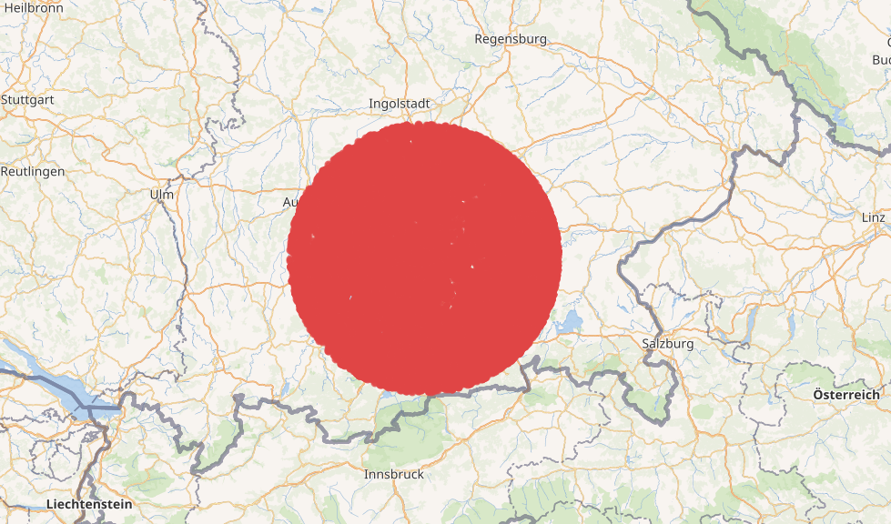
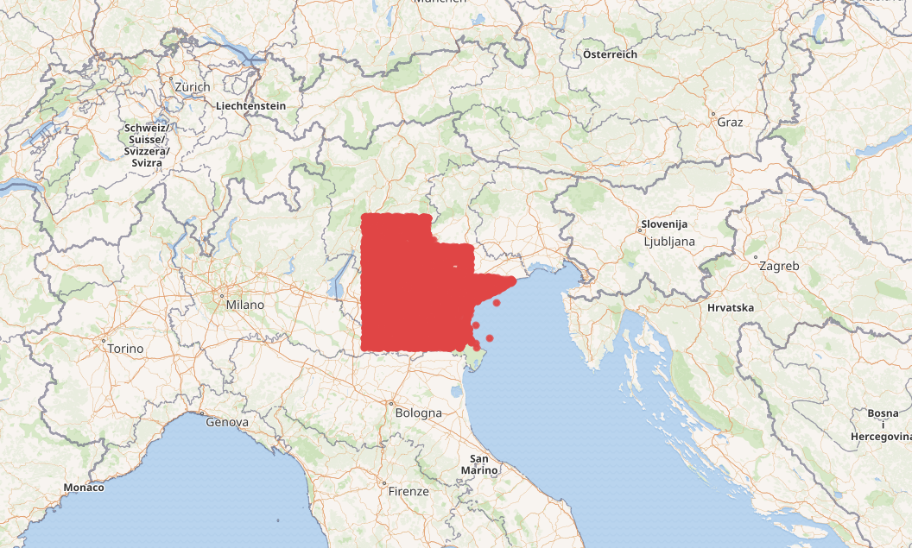

# 🌍 GeoSpatial Search

**GeoSpatial Search** is a Rust project focused on developing a fast and efficient algorithm for finding all neighboring points on the globe. It adapts the principles of KD-Trees to spherical geometry, enabling high-performance geospatial queries using great-circle distances.

This project has been integrated into the **Graph Database Query system** currently being developed at the **University of Bayreuth**, where it is used for geospatial indexing and proximity search on large-scale spatial data.

--

## ✨ Features

- Efficient search for nearby points based on geodesic (haversine) distance (radius search, box search) 
- KD-Tree-inspired structure adapted for spherical coordinates  
- Handles latitude and longitude inputs directly  
- Suitable for large-scale datasets and real-time applications  
- Designed for speed and accuracy in global proximity search

--

## Examples

### Radius Distance Search

Example was created using [Wikidata Query Service](https://query.wikidata.org/#SELECT%20%3Fplace%20%3FplaceLabel%20%3Fcoord%20%3Fdist%0AWHERE%20%7B%0A%20%20SERVICE%20wikibase%3Aaround%20%7B%0A%20%20%20%20%3Fplace%20wdt%3AP625%20%3Fcoord%20.%0A%20%20%20%20bd%3AserviceParam%20wikibase%3Acenter%20%22Point%2811.5754%2048.1371%29%22%5E%5Egeo%3AwktLiteral%20.%0A%20%20%20%20bd%3AserviceParam%20wikibase%3Aradius%20%2260%22%20.%20%20%23%20radius%20in%20kilometers%0A%20%20%20%20bd%3AserviceParam%20wikibase%3Adistance%20%3Fdist%20.%0A%20%20%7D%0A%20%20SERVICE%20wikibase%3Alabel%20%7B%20bd%3AserviceParam%20wikibase%3Alanguage%20%22en%22.%20%7D%0A%7D)

### Box Search

Example was created using [Wikidata Query Service](https://query.wikidata.org/#SELECT%20%3Fplace%20%3FplaceLabel%20%3Fcoord%0AWHERE%20%7B%0A%20%20SERVICE%20wikibase%3Abox%20%7B%0A%20%20%20%20%3Fplace%20wdt%3AP625%20%3Fcoord%20.%0A%20%20%20%20bd%3AserviceParam%20wikibase%3AcornerWest%20%22Point%2811.00%2048.00%29%22%5E%5Egeo%3AwktLiteral%20.%0A%20%20%20%20bd%3AserviceParam%20wikibase%3AcornerEast%20%22Point%2815.00%2045.00%29%22%5E%5Egeo%3AwktLiteral%20.%0A%20%20%7D%0A%20%20SERVICE%20wikibase%3Alabel%20%7B%20bd%3AserviceParam%20wikibase%3Alanguage%20%22en%22.%20%7D%0A%7D%0ALIMIT%2020000)

